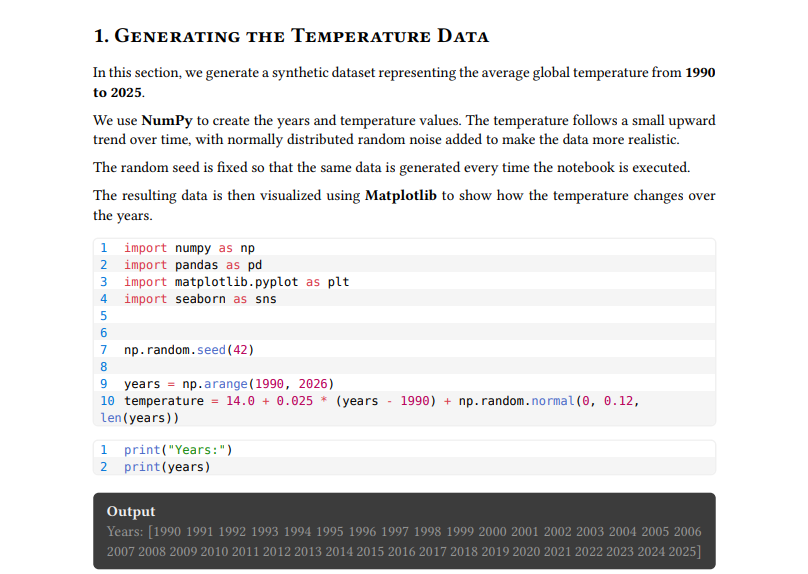

# Notebook files to Typst
.ipynb files to decent looking PDFs. Jupdf is a tool that turns "notebook" files to .typ (Typst) files that can then be edited manually and compiled to PDFs.

# How to use?
There are 2 main ways to use this tool. Make sure that for both of them, you have the "notebook" file in the same directory as the executable or python script.

### 1. As a python module
Module requirements
- nbformat(5.11.1)

```bash
python -m jupdf.py [filename.ipynb]
```
### 2. Using the binaries
There are only compiled binaries for windows.

```bash
jupdf.exe [filename.ipynb]
```

# Example result

```bash
typst compile [filename.typ]
```


